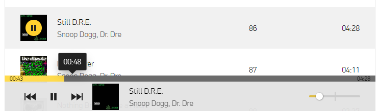

# app-music

<h2 align="left"><a href="https://olzx.github.io/song-player/demo" target="_blank">Demo</a></h2>


## Project setup
```
npm install
```

### Compiles and hot-reloads for development
```
npm run serve
```

### Compiles and minifies for production
```
npm run build
```

### Lints and fixes files
```
npm run lint
```

### Customize configuration
See [Configuration Reference](https://cli.vuejs.org/config/).
